# 1 . Verificador de Idade para Habilitação
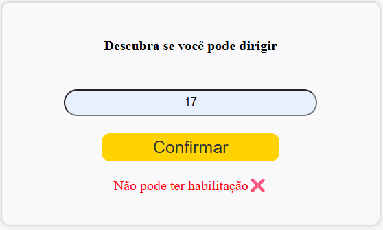
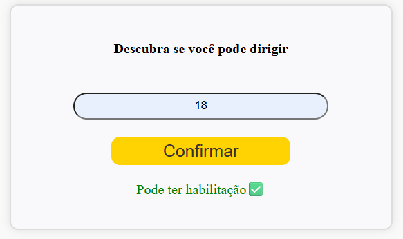

# 2. Determinar o Maior entre Três
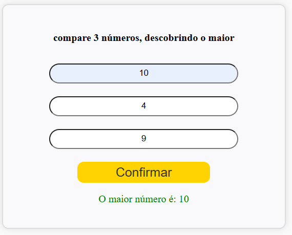
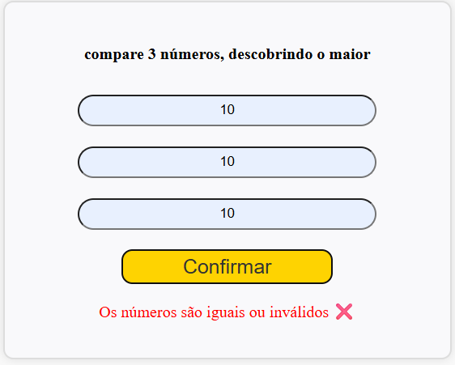

# 3.Classificador de Moedas
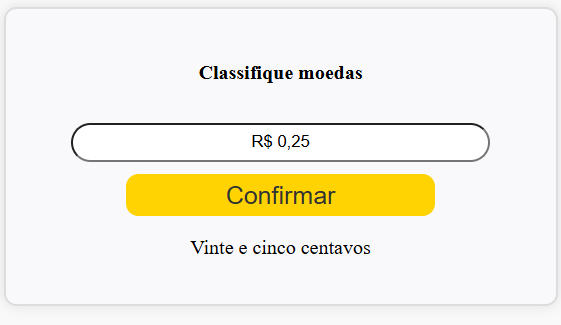
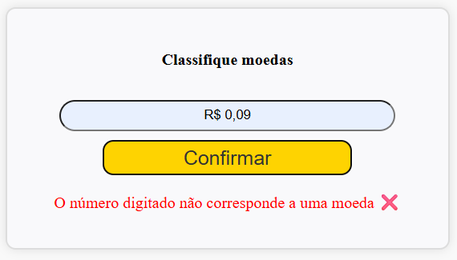

# 4. Verificador de Senha (Critérios Múltiplos)
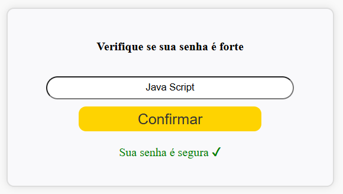
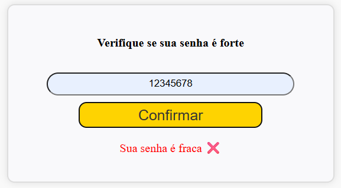

# 5. Alerta de Temperatura
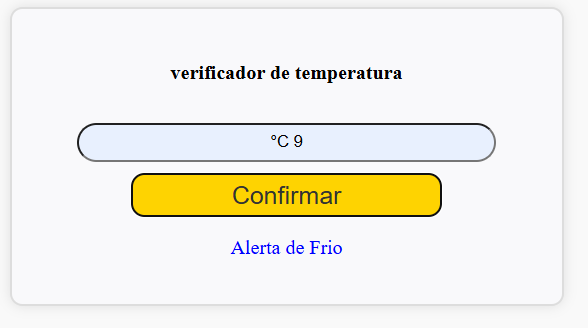
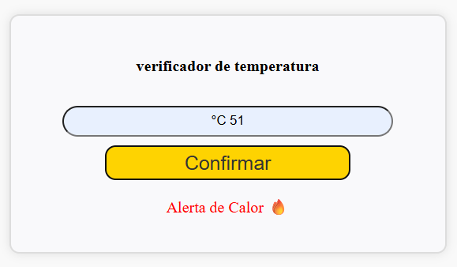
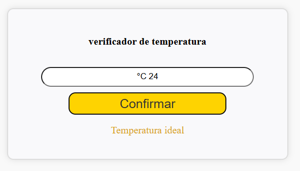

# 6. Classificador de Dia da Semana
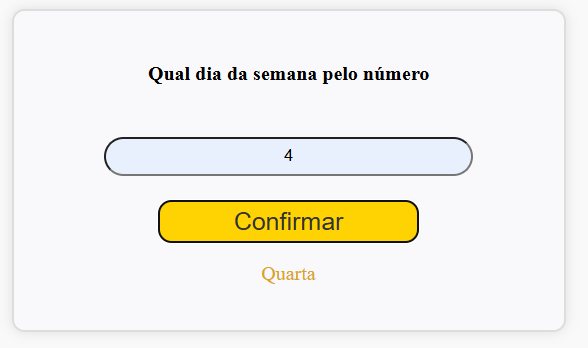
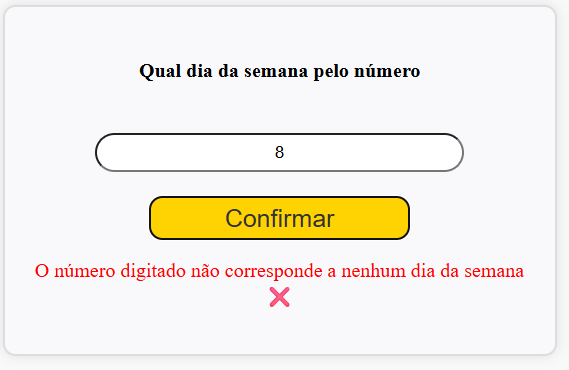

# 7. Tipo de Triângulo
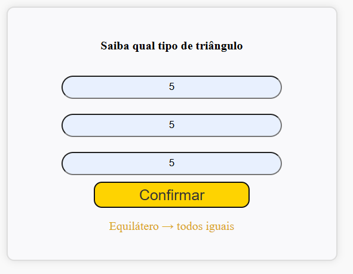
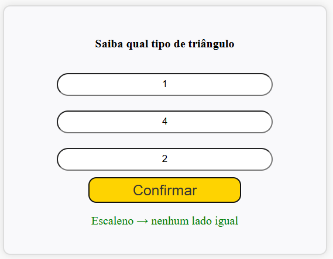
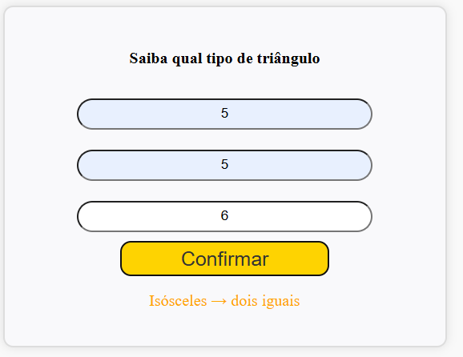

# 8. Gerador de Nome Completo
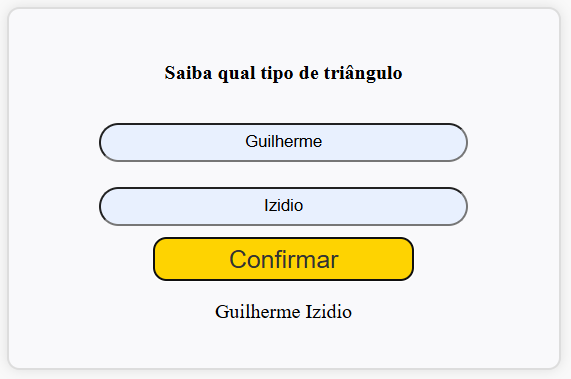

# 9.Calculadora de Média (Dois Valores)
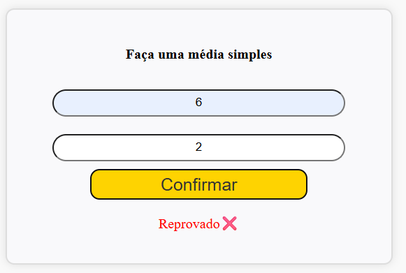
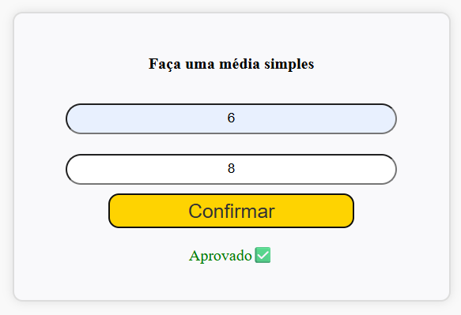

# 10. Formatação de Telefone Simples
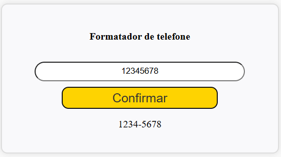