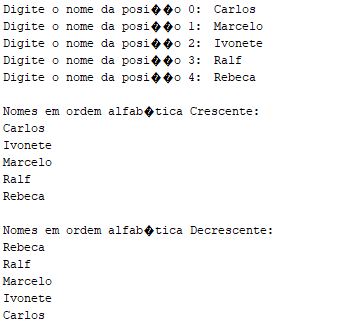
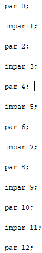

🎯 Objetivo

Criar um algoritmo em Java que:

1️⃣ Leia vários números, exibindo:

Números pares

Números ímpares

2️⃣ Leia vários nomes, exibindo:

Nomes em ordem crescente

Nomes em ordem decrescente

⚙️ Linguagem e Conceitos Utilizados

Linguagem: Java ☕

Conceitos:

Vetores / Arrays

Estruturas de repetição (for, foreach)

Condicionais (if, % 2 == 0)

Ordenação (Arrays.sort)

Impressão em ordem inversa

🧩 Prints da Execução

Parte 1 – 
Imagem Array nomes em ordem crecente e decrecente

Parte 2 – 
Imagem Array Números pares e Impares
