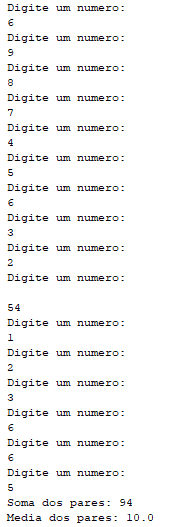
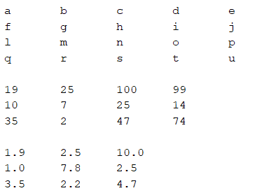
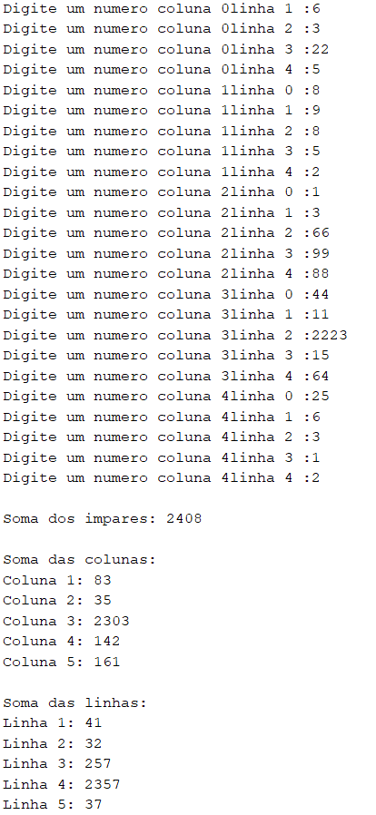
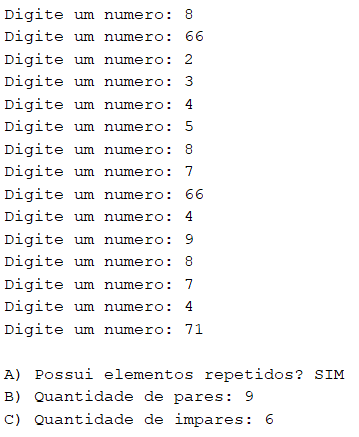
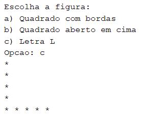
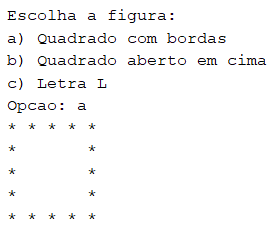
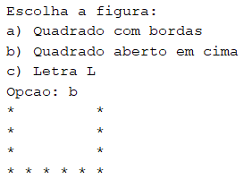

## Escreva um programa que leia uma matriz 4 x 4 e ao final exiba:
** - a soma dos números pares digitados,
** - a média dos números pares digitados.

## Crie programas em Java que crie e exiba as seguintes matrizes abaixo:

## Faça um algoritmo que preencha uma matriz 5x5 de inteiros e escreva:
** a. a soma dos números ímpares fornecidos;
** b. a soma de cada uma das 5 colunas;
** c. a soma de cada uma das 5 linhas;

## Crie em Java uma matriz 3x5 de inteiros, preencha a matriz e depois:
** a. Informe se a matriz possui elementos repetidos;
** b. A quantidade de números pares;
** c. A quantidade de números ímpares;

## Crie em Java uma matriz 4x4 de decimais, preencha a matriz e depois:
** a. Exiba os valores da sua diagonal principal;
** b. Exiba os valores da sua diagonal secundária

## Crie programas em Java que crie e exiba as seguintes figuras abaixo utilizando matrizes:

