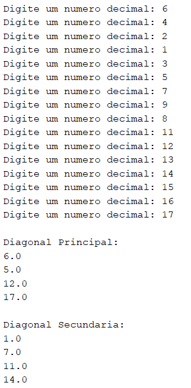

# Matrizes (Java)

Coleção de exercícios com matrizes em Java e imagens de referência (pasta `IMG`).

## 1. Matriz 4x4 – pares
Arquivo: `Matriz4X4.java`
- Ler uma matriz 4x4 de inteiros.
- Exibir soma e média dos números pares informados.

## 2. Matrizes fixas de exemplo
Arquivo: `Matrizes.java`
- Exibir as matrizes fornecidas nas figuras.

## 3. Matriz 5x5 – somas
Arquivo: `Matriz_5X5_Inteiros.java`
- Preencher uma 5x5 de inteiros e informar:
  - Soma dos números ímpares.
  - Soma de cada coluna.
  - Soma de cada linha.

## 4. Matriz 3x5 – análise
Arquivo: `Matriz_3X5.java`
- Preencher uma 3x5 de inteiros e indicar:
  - Se há elementos repetidos.
  - Quantos números pares.
  - Quantos números ímpares.

## 5. Matriz 4x4 de decimais – diagonais
Arquivo: `Matriz4X4Decimais.java`
- Preencher uma 4x4 de decimais e exibir:
  - Valores da diagonal principal.
  - Valores da diagonal secundária.

## 6. Figuras com matrizes
Arquivo: `Figura.java`
- Gerar as figuras L, Q e U usando matrizes.

## Como executar
1. No diretório `Matrizes`, compile o arquivo desejado: `javac NomeDoArquivo.java`
2. Execute: `java NomeDoArquivo`
3. As imagens de saída esperada estão em `IMG`.
